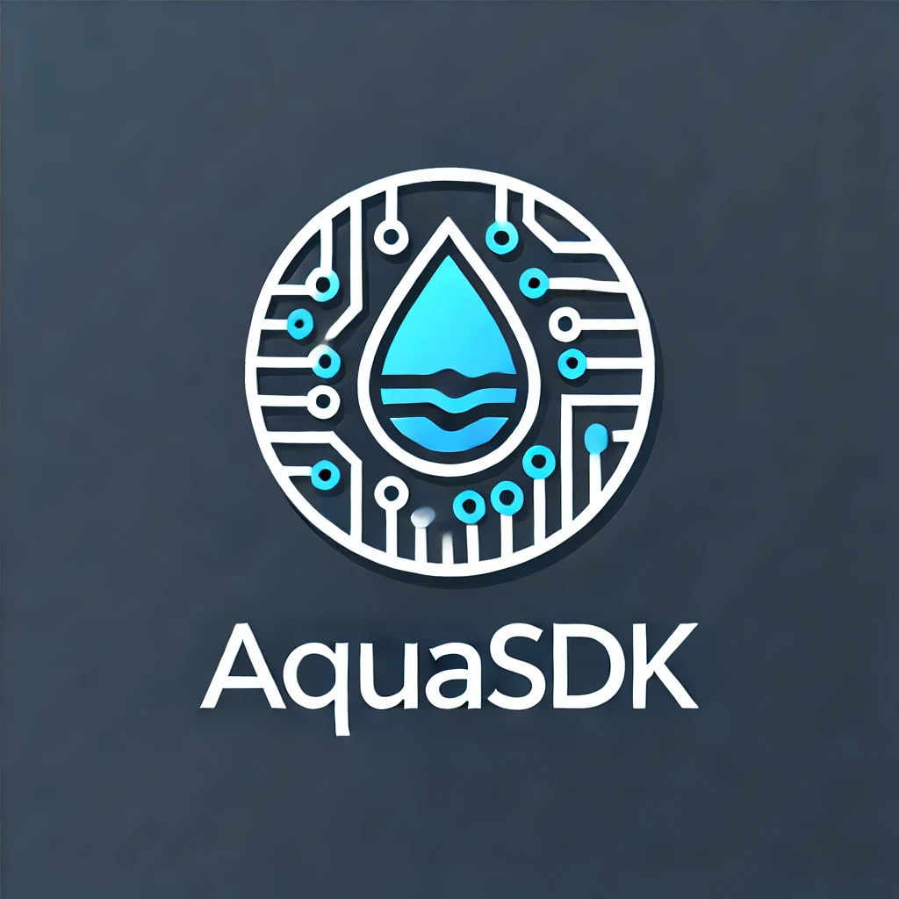

# **AquaSDK**

**A modern JavaScript SDK generator from OpenAPI specs**



AquaSDK is an open-source tool that generates a fully-featured JavaScript SDK from an OpenAPI specification. It enables easy integration with APIs through a chainable, **Waterline-like** syntax. AquaSDK helps you rapidly create SDKs, making it easier to interact with RESTful APIs.

### **Why**

**Waterline ORM**, commonly used in [Sails.js](https://sailsjs.com/), is often praised for its intuitive and flexible syntax, which simplifies database interactions.

---

> **⚠️ Note on Upcoming v2.0.0 Release**
>
> We are excited to announce that version 2.0.0 is underway! This major update will introduce significant improvements, including a more robust and intuitive Waterline-style query builder.
>
> Please be aware that **v2.0.0 will include breaking changes**. The new query builder is designed to be more powerful and flexible, but it will require updates to your existing code. We believe the long-term benefits will be well worth the one-time migration effort.

---

## 📦 **Installation**

You can easily install AquaSDK globally, or locally for development.

### Global Installation
Install AquaSDK globally for command-line access:
```bash
npm install -g aquasdk
```

### Local Installation (for development)
To install locally and contribute to the project:
```bash
# Clone the repository
git clone https://github.com/enricodeleo/aquasdk.git
cd aquasdk
npm install
npm link
```

---

## 🛠 **Usage**

Once installed, you can use the `generate-sdk` command to generate a JavaScript SDK from an OpenAPI specification.

```bash
generate-sdk <swagger-file-path> <output-directory> <version> [--verbose]
```

### Arguments

- `swagger-file-path`: Path to your OpenAPI/Swagger JSON file (default: `./swagger.json`)
- `output-directory`: Directory where the SDK will be generated (default: `./sdk`)
- `version`: The version number of the generated SDK (default: `1.0.0`)
- `--verbose`: Flag for detailed logging

### Example

```bash
generate-sdk ./swagger.json ./sdk 1.0.0 --verbose
```

---

## 🎉 **Features of the Generated SDK**

The generated SDK includes the following features:

- **Waterline-like Syntax**: Chainable query methods for interacting with your API, similar to Sails.js/Waterline. Brings ORM-style chaining (`.find()`, `.limit()`, `.sort()`) to REST API calls, making client-side code more expressive.
- **Thenable Queries**: Await queries directly without needing an `.execute()` call, leading to cleaner, more intuitive code.
- **OpenAPI-Driven Development**: Automates SDK generation from specs, reducing human error and ensuring alignment with API contracts.
- **Promise-based API**: All API calls return promises, making them compatible with `async/await`.
- **Response Headers Access**: All API responses include both data and headers, allowing access to important HTTP header information.
- **Support for Associations**: Handling relationships via `.populate()` mirrors Waterline's eager-loading, a standout feature for nested resources.
- **Configurable HTTP Client**: Support for additional Axios configuration options to customize timeout, headers, and other HTTP client settings.

---

## 💻 **SDK API Example**

Once the SDK is generated, you can use it as follows:

### Example Code
```javascript
import API from './sdk/index.js';
import { operators } from './sdk/utils/queryUtils.js';

// Initialize the SDK
const api = new API({
  baseUrl: 'https://api.example.com',
  auth: {
    token: 'your-auth-token'
    // Or use basic auth
    // username: 'user',
    // password: 'pass'
  },
  // Additional Axios configuration options
  timeout: 5000,
  headers: {
    'Custom-Header': 'value'
  },
});

// Examples using the new Waterline-style syntax
async function examples() {
  // Find all users (queries are now "thenable")
  const usersResponse = await api.users.find();
  const users = usersResponse.data;
  const headers = usersResponse.headers;

  // Find a single user by ID and select specific fields
  const user = await api.users.findOne(123).select(['name', 'email']);

  // Find active users, populate their company, and sort by creation date
  const activeUsers = await api.users
    .find({ active: true })
    .populate('company')
    .sort('createdAt DESC');

  // Advanced query with pagination and field selection
  const paginatedAdmins = await api.users
    .find({ role: 'admin' })
    .limit(10)
    .skip(20)
    .select(['name', 'lastLogin']);

  // Create a new user
  const newUser = await api.users.create({
    name: 'John Doe',
    email: 'john@example.com'
  });
  
  // Access response headers (e.g., for rate limiting info)
  console.log('Rate limit remaining:', newUser.headers['x-rate-limit-remaining']);

  // Update an existing user
  const updatedUser = await api.users.update(123, { name: 'Jane Doe' });

  // Delete a user
  await api.users.destroy(123);

  // Use complex criteria with operators for more powerful queries
  const recentSignups = await api.users.find({
    createdAt: operators.greaterThan(new Date('2024-01-01')),
    status: operators.notIn(['archived', 'deleted'])
  });
}
```

---

## 🔍 **How It Works**

### 1. **Reads the OpenAPI spec**
AquaSDK parses your Swagger/OpenAPI JSON definition to understand your API's structure.

### 2. **Preprocesses the spec**
The tool resolves circular references and prepares the API definition for SDK generation.

### 3. **Generates Model Classes**
A class is created for each model in the OpenAPI schema, ensuring proper data handling and validation.

### 4. **Builds Method Chains**
AquaSDK generates a Waterline-like query syntax for accessing your API’s resources.

### 5. **Creates the SDK**
A complete SDK is generated, including methods, models, and utility files.

---

## 🚀 **Development and Contribution**

Since AquaSDK is open source, we welcome contributions from developers who wish to improve the tool, add features, or fix bugs.

### How to Contribute

1. Fork the repository and create a new branch.
2. Make your changes and commit them with clear messages.
3. Push your changes and submit a pull request with a description of your updates.

We appreciate all contributions and aim to review pull requests as quickly as possible.

---

## 📄 **License**

AquaSDK is licensed under the **GNU General Public License v3.0 (GPL-3.0)**. See the [LICENSE](LICENSE.md) file for more information.

The GPL-3.0 license allows you to freely use, modify, and distribute AquaSDK, but requires that you make any derivative works available under the same license. If you distribute AquaSDK, or any derivative works, you must include the source code and provide the GPL license terms.

For more details, please refer to the [GNU General Public License v3.0](https://www.gnu.org/licenses/gpl-3.0.html).

---

Feel free to use, modify, and contribute to AquaSDK! We hope this tool helps you build better, more efficient integrations with OpenAPI-based APIs. 🚀