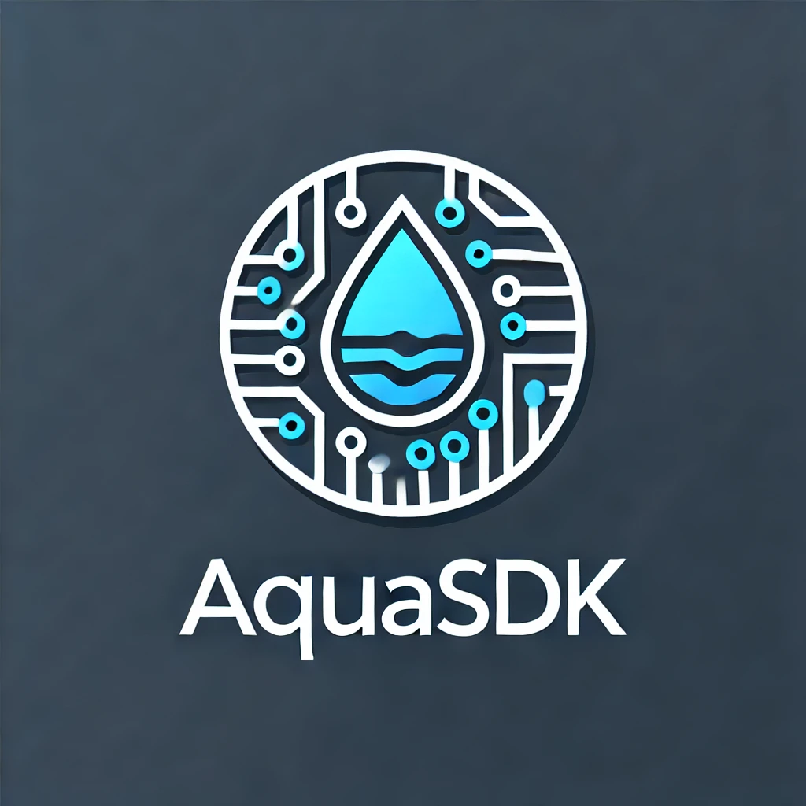

<h1 align="center">AquaSDK</h1>

<p align="center">
  <strong>Generate a chainable JavaScript SDK from an OpenAPI 3.x spec.</strong>
</p>

<p align="center">
  <a href="#quick-start">Quick Start</a> · <a href="#how-it-works">How It Works</a> · <a href="#supported--unsupported">Scope</a> · <a href="#sdk-api">SDK API</a> · <a href="#cli">CLI</a>
</p>

<p align="center">
  
</p>

---

## What is AquaSDK?

AquaSDK reads an OpenAPI/Swagger specification and emits a ready-to-use JavaScript SDK with a Waterline-style, chainable query syntax. One command turns your API contract into an ergonomic client — methods, models, sub-resources, and all.

## Why

Hand-written SDKs drift from the spec. Generic generators produce verbose, callback-shaped code that feels nothing like the rest of your JavaScript.

AquaSDK takes the opposite approach: the generated SDK reads like [Waterline ORM](https://sailsjs.com/documentation/reference/waterline-orm) — the query builder popularised by Sails.js — so working with a remote API feels like working with a local model.

- queries are thenable (`await api.users.find()`, no `.execute()`)
- resources chain naturally (`.find().populate('company').sort('createdAt DESC')`)
- sub-resources nest the way they do in the spec (`api.companies(id).people.find()`)
- responses expose both `data` and `headers` for rate limits, pagination, etc.

**Use it for:** client libraries for internal services, integration tests, prototyping against a spec, replacing hand-written API wrappers.

**Don't use it for:** APIs without an OpenAPI spec, or when you need bespoke auth flows the generator can't express.

## Quick Start

```bash
# Install globally
npm install -g aquasdk

# Generate an SDK from a spec
generate-sdk ./openapi.json ./sdk 1.0.0
```

Then use it:

```javascript
import API from './sdk/index.js';

const api = new API({
  baseUrl: 'https://api.example.com',
  auth: { token: 'your-auth-token' },
});

// List with filters, pagination, and populated relations
const { data, headers } = await api.users
  .find({ active: true })
  .populate('company')
  .sort('createdAt DESC')
  .limit(10);

// Create
await api.users.create({ name: 'John Doe', email: 'john@example.com' });

// Update / delete
await api.users.update(123, { name: 'Jane Doe' });
await api.users.destroy(123);

// Sub-resources
const companyPeople = await api.companies('comp_123').people.find();
```

## How It Works

1. **Parse** — reads your OpenAPI/Swagger JSON and resolves `$ref` pointers
2. **Preprocess** — handles circular references and normalises the spec
3. **Model** — emits a class per schema with typing-friendly field definitions
4. **Chain** — builds a Waterline-style query builder per resource, including sub-resources
5. **Bundle** — writes a self-contained SDK (models, methods, utilities) to the output directory

The generated SDK depends only on Axios and has no runtime dependency on AquaSDK itself.

## Supported / Unsupported

### Supported

- OpenAPI 3.x and Swagger 2.0 specs (JSON or YAML)
- CRUD methods: `find`, `findOne`, `create`, `update`, `destroy`
- Query builder: `where`, `select`, `sort`, `limit`, `skip`, `populate`
- Rich operators (`greaterThan`, `notIn`, etc.) for complex `where` clauses
- Nested sub-resources derived from path hierarchies
- Response headers exposed alongside data on every call
- Bearer token and basic auth out of the box
- Custom Axios config (timeout, headers, interceptors) via the constructor
- Escape hatch: `api.client.request(...)` for endpoints the generator doesn't cover

### Not supported

- GraphQL or non-REST APIs
- Runtime schema validation of responses
- Mocking — pair with [Crudio](https://github.com/enricodeleo/crudio) if you need a backend
- File uploads / multipart (planned)
- OAuth flows beyond static tokens

## SDK API

```javascript
import API from './sdk/index.js';
import { operators } from './sdk/utils/queryUtils.js';

const api = new API({
  baseUrl: 'https://api.example.com',
  auth: {
    token: 'your-auth-token',
    // or: username: 'user', password: 'pass'
  },
  timeout: 5000,
  headers: { 'Custom-Header': 'value' },
});

// Find one with field selection
const user = await api.users.findOne(123).select(['name', 'email']);

// Complex criteria with operators
const recentSignups = await api.users.find({
  createdAt: operators.greaterThan(new Date('2024-01-01')),
  status: operators.notIn(['archived', 'deleted']),
});

// Access response metadata
const created = await api.users.create({ name: 'John Doe' });
console.log('Rate limit remaining:', created.headers['x-rate-limit-remaining']);
```

### Custom requests

For endpoints not covered by generated methods, fall back to the underlying Axios client:

```javascript
const response = await api.client.request({
  method: 'get',
  url: '/some_custom_endpoint',
  params: { custom_param: 'value' },
});
```

## CLI

```
Usage: generate-sdk <spec-file> <output-dir> <version> [options]

  <spec-file>    Path to your OpenAPI/Swagger file (default: ./swagger.json)
  <output-dir>   Directory where the SDK is written (default: ./sdk)
  <version>      Version of the generated SDK (default: 1.0.0)
  --verbose      Enable detailed logging
```

Example:

```bash
generate-sdk ./swagger.json ./sdk 1.0.0 --verbose
```

## Ecosystem

AquaSDK pairs well with [Crudio](https://github.com/enricodeleo/crudio), which turns the same OpenAPI spec into a stateful CRUD backend.

- **AquaSDK**: generate the client from the spec
- **Crudio**: run the backend from the spec

Point both at one OpenAPI document and you have a fully wired client and server derived from a single contract.

## License

GPL-3.0-or-later. See [LICENSE.md](LICENSE.md).
